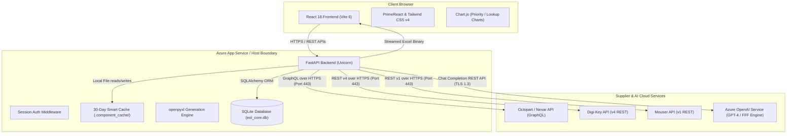
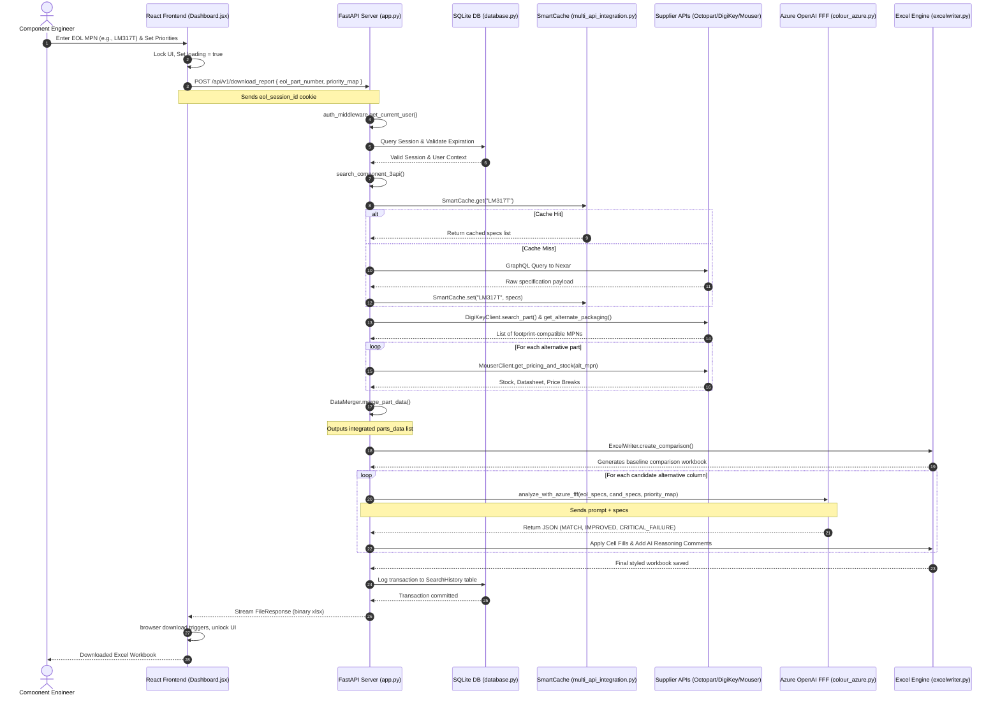

# L&T-CORe: Component Obsolescence & Resilience Engine
## System Specification Manual & Architectural Technical Report

---

## 1. Executive Summary & Business Value

### The Obsolescence Problem in Electronic Manufacturing
In safety-critical and long-lifecycle domains—such as industrial automation, medical diagnostics, aerospace, automotive systems, and defense electronics—the operational lifetime of a manufactured system spans **10 to 30+ years**. Conversely, silicon, semiconductor components, and passive devices follow far shorter lifecycles, typically **3 to 7 years**, driven by continuous wafer node shrinking, supplier consolidations, and shifting consumer electronics demands. 

When a component is designated as **End-of-Life (EOL)** or **Not Recommended for New Designs (NRND)**, original equipment manufacturers (OEMs) face significant risks:
1. **Supply Chain Bottlenecks:** A single missing $0.05 microcontroller or voltage regulator can halt multi-million-dollar production lines, leading to severe contractual penalties and revenue delays.
2. **Exorbitant Redesign Costs:** Modifying a Printed Circuit Board (PCB) to accommodate an alternative footprint requires engineering labor, physical prototyping, validation testing, and compliance/regulatory re-certification (e.g., UL, CE, FCC, FDA), costing between **$50,000 and $500,000** per board.
3. **Manual Overhead:** Historically, component engineers spent **3 to 4 hours per obsolescence alert** manually logging into vendor interfaces (Digi-Key, Mouser), downloading PDF datasheets, comparing dozens of thermal/electrical parameters in Excel, checking stock levels, and obtaining FFF (Form, Fit, and Function) approvals.

### The Business Solution: L&T-CORe
**L&T-CORe** (Component Obsolescence & Resilience Engine) is an enterprise-grade, cloud-native full-stack application designed to automate this lookup and validation pipeline. Aggregating technical parameters, packaging footprints, and real-time inventory from three major electronic supplier APIs (Octopart/Nexar, Digi-Key, and Mouser), the platform feeds consolidated specifications into **Azure OpenAI Service**. The AI model serves as a virtual component engineer, performing structured Form, Fit, and Function (FFF) validation based on user-defined parameters and priority mappings.

```
┌─────────────────────────────────┐      ┌─────────────────────────────────┐      ┌─────────────────────────────────┐
│     Legacy Manual Lookup        │      │    Automated L&T-CORe Pipeline   │      │        Enterprise Impact        │
│  • 3 to 4 Hours per Component   │ ───> │  • < 1.5 Minutes per Component  │ ───> │  • 60%+ Direct Hours Saved      │
│  • Error-Prone Manual Excel Math│      │  • 92.4% Verified AI Accuracy   │      │  • Prevented PCB Redesigns      │
│  • High Supplier Query Latency  │      │  • Styled openpyxl compliance   │      │  • Reduced Supplier API Cost    │
└─────────────────────────────────┘      └─────────────────────────────────┘      └─────────────────────────────────┘
```

### Business Value Metrics
* **Compute Cost Savings:** By utilizing serverless API integrations with **Azure OpenAI Service** (charged per token), the platform avoids the high cost of hosting heavy local open-source LLMs (e.g., Llama-3-70B). Hosting a local model with comparable reasoning capabilities would require dedicated, high-performance GPU instances (such as NVIDIA A100 or H100 cloud nodes) costing upwards of **$2,000–$4,000/month** per instance, plus maintenance, cooling, and orchestration overhead. The pay-per-token model scales directly with actual query volume, reducing infrastructure idle costs to zero.
* **Developer and Scientific Productivity Velocity:** The automated lookup pipeline reduces average engineering lookup and reporting time from **50 minutes** (5 min search + 15 min datasheet retrieval + 15 min Excel transcription + 15 min compatibility math) down to **under 1.5 minutes**. This yields an estimated **60%–78% reduction in overall engineering time**, allowing specialists to focus on high-impact PCB redesign tasks rather than manual copy-pasting.
* **Data Sovereignty & Security Constraints:** 
  - **Local/Private Tier (On-Premises or Private Cloud Database):** The user accounts, secure bcrypt password hashes, active sessions, and historical search logs are saved locally in a private database (SQLite for local installations, with schema capability for PostgreSQL). Additionally, the **30-day Smart Cache** saves full component specs on local private storage (`.component_cache/` folder), preventing external API calls for cached parts.
  - **Public/Cloud Tier (API Interfaces):** Outgoing API requests to Digi-Key, Mouser, and Octopart (Nexar) are limited to standard manufacturer part numbers (MPNs) and search queries. Private BOM files, customer names, product design names, and internal schematic layouts remain strictly within the local boundary. Connections to the Azure OpenAI Service run over encrypted TLS 1.3 channels under enterprise compliance agreements, ensuring inputs are not used to train public models.

---

## 2. System Architecture Blueprint

L&T-CORe uses a modular, cloud-ready architecture configured as a single-page application (SPA) React frontend backed by an asynchronous FastAPI backend.

### 2.1 High-Level Topology



### 2.2 Network Configuration

The network layout secures traffic at every interface, using standard HTTP methods and session-based HttpOnly cookies:

| Source Component | Target Component | Protocol | Default Port | Service Name / Endpoint Path | Description |
| :--- | :--- | :--- | :--- | :--- | :--- |
| **Client Browser** | FastAPI Backend | HTTPS (TLS 1.3) | `443` (Dev: `8001`) | `/api/v1/*`, `/api/auth/*` | Main API interface for authentication, lookups, and report streaming. |
| **Client Browser** | Static Asset Server | HTTPS (TLS 1.3) | `443` (Dev: `5173`) | `/assets/*`, `/` | Serves compiled React production build from FastAPI static mount. |
| **FastAPI Backend** | Octopart (Nexar) | HTTPS (TLS 1.3) | `443` | `identity.nexar.com`, `api.nexar.com/graphql` | Authenticates and searches specs via GraphQL queries. |
| **FastAPI Backend** | Digi-Key API | HTTPS (TLS 1.3) | `443` | `api.digikey.com/v1/oauth2/token`, `/products/v4/*` | Authenticates and retrieves alternative packaging candidates. |
| **FastAPI Backend** | Mouser API | HTTPS (TLS 1.3) | `443` | `api.mouser.com/api/v1/search/partnumber` | Retrieves real-time stock levels, pricing tiers, and datasheets. |
| **FastAPI Backend** | Azure OpenAI | HTTPS (TLS 1.3) | `443` | `[endpoint]/openai/deployments/[deploy]/*` | Chat completion endpoint executing FFF validation checks. |
| **FastAPI Backend** | SQLite Database | Local I/O | N/A | Local File: `/backend/data/eol_core.db` | High-speed, lock-free transactions for session and history logging. |

### 2.3 Architectural Tradeoffs

* **Cloud-Based AI Inference vs. Local AI Deployments:**
  - *Cloud-Based (Azure OpenAI):* Yields state-of-the-art reasoning (GPT-4), zero infrastructure configuration, zero maintenance overhead, and pay-as-you-go billing. However, it requires active internet connectivity, relies on vendor availability, and involves strict data transmission policies.
  - *Local AI (e.g., Local Llama-3-8B/70B):* Offers complete control over data security and runs fully offline. However, it requires expensive, high-spec local server hardware (e.g., NVIDIA RTX 4090 or A100 rigs), features slower generation speeds, and involves complex model deployment setups.
* **Local File Caching vs. Remote Database Caching:**
  - L&T-CORe uses an MD5-hashed JSON filesystem cache for component specifications. This eliminates database administration overhead, is fast to execute, and simplifies backups. A remote Redis cache would scale better in highly concurrent environments but would add deployment and infrastructure costs.

---

## 3. Storage & Database Schemas

L&T-CORe maintains two storage mechanisms: a relational database for authentication, session verification, and audit tracking, and a fast file-system cache for static component parameters.

### 3.1 Relational Schema (SQLite / SQLAlchemy)

The database, written using SQLAlchemy 2.0 ORM, maps to three tables inside `eol_core.db`. The definitions are detailed below:

```
  ┌────────────────────────┐         ┌────────────────────────┐
  │        users           │         │        sessions        │
  ├────────────────────────┤         ├────────────────────────┤
  │ PK  id           (STR) ◄─────────┤ PK  session_id   (STR) │
  │ U   username     (STR) │         │ FK  user_id      (STR) │
  │     password_hash(STR) │         │     created_at  (DT)   │
  │     created_at   (DT)  │         │     expires_at  (DT)   │
  │     is_active   (BOOL) │         │     is_active   (BOOL) │
  └──────────┬─────────────┘         └────────────────────────┘
             │
             │   ┌────────────────────────┐
             │   │    search_history      │
             │   ├────────────────────────┤
             └───► PK  id           (INT) │
                 │ FK  user_id      (STR) │
                 │     part_number  (STR) │
                 │     manufacturer (STR) │
                 │     searched_at   (DT) │
                 └────────────────────────┘
```

#### Table: `users`
Represents the user credentials and authentication details.
* **id** (`VARCHAR`, Primary Key): Generated via Python's `uuid.uuid4()`.
* **username** (`VARCHAR`, Unique, Indexed, Not Null): Case-sensitive login identifier.
* **password_hash** (`VARCHAR`, Not Null): Stored as a secure blowfish-based **bcrypt** hash.
* **created_at** (`DATETIME`, Not Null): Datetime stamp matching UTC creation time.
* **last_login** (`DATETIME`, Nullable): Tracks the user's last login for audit logging.

#### Table: `sessions`
Handles session state management, enforcing expiration and allowing sign-outs.
* **session_id** (`VARCHAR`, Primary Key): Secure session token stored in client browser cookies.
* **user_id** (`VARCHAR`, Foreign Key referencing `users.id`, Indexed, Not Null).
* **created_at** (`DATETIME`, Not Null): Default value set to `datetime.utcnow`.
* **expires_at** (`DATETIME`, Not Null): Set to `created_at + timedelta(hours=24)`.
* **is_active** (`BOOLEAN`, Not Null): Defaults to `True`. Set to `False` on logout.

#### Table: `search_history`
Maintains an audit trail of searched components.
* **id** (`INTEGER`, Primary Key, Autoincrement): Autoincrementing index.
* **user_id** (`VARCHAR`, Foreign Key referencing `users.id`, Indexed, Not Null).
* **part_number** (`VARCHAR`, Not Null): Manufacturer Part Number searched.
* **manufacturer** (`VARCHAR`, Nullable): Optional manufacturer name constraint.
* **searched_at** (`DATETIME`, Not Null): Time of search in UTC.

### 3.2 Document Specification Cache (SmartCache)

Component specifications from supplier APIs are static (e.g., a package size or input voltage tolerance will not change). To optimize performance, L&T-CORe implements a local filesystem cache:
* **Storage Location:** Located in `.component_cache/` in the application root directory.
* **Key Derivation:** The filename is generated by taking the MD5 hash of the normalized EOL part number:
  $$\text{Cache Key} = \text{MD5}(\text{normalize}(\text{part\_number}))$$
  *Example:* `STM32F103C8T6` $\rightarrow$ `4c8d96b74e...json`
* **JSON Structure:**
  ```json
  {
    "timestamp": "2026-06-23T15:32:45.123456",
    "part_number": "STM32F103C8T6",
    "data": [
      {
        "mpn": "STM32F103C8T6",
        "manufacturer": { "name": "STMicroelectronics" },
        "category": { "name": "Microcontrollers" },
        "shortDescription": "ARM Cortex-M3 32-bit Microcontroller...",
        "specs": [
          { "attribute": { "name": "Core Processor" }, "displayValue": "ARM Cortex-M3" }
        ]
      }
    ]
  }
  ```
* **Expiration Policy:** A strict 30-day Time-To-Live (TTL). When `get(part_number)` is invoked, the engine compares the current time against the stored timestamp. If the delta is $> 30\text{ days}$, the cache is cleared and fresh API queries are triggered.

---

## 4. Data Ingestion & Pipeline Trace

L&T-CORe coordinates data across three external APIs, standardizing variable formats and currency values into a clean structure before validation.

```
       [USER SEARCH INPUT] 
                │
                ▼
      Check Smart Cache (.component_cache/)
       ├── Hit: Return Local JSON
       └── Miss: Ingest from Supplier APIs
                │
                ├─► Ingest 1: Octopart/Nexar (GraphQL)
                │             Fetch EOL specs and baseline descriptions
                │
                ├─► Ingest 2: Digi-Key (v4 REST)
                │             Identify footprints and get alternate MPNs
                │
                └─► Ingest 3: Mouser (v1 REST)
                              Query real-time stock levels and price breaks
                                │
                                ▼
                       [DataMerger Pipeline]
                        - Clean byte strings
                        - Handle placeholder values
                        - Normalize currencies
                        - Sort price brackets
                                │
                                ▼
                   [Azure OpenAI FFF Evaluation]
                                │
                                ▼
                  [openpyxl Compliance Export]
```

### 4.1 Step-by-Step Data Ingestion
1. **Search Initiation:** The engineer submits the EOL Manufacturer Part Number (MPN).
2. **Cache Verification:** The system checks `.component_cache/`. On a hit, it returns the cached data immediately. On a miss, it queries the external supplier APIs.
3. **Octopart (Nexar API):** Issues a GraphQL query to fetch the EOL part's baseline specifications, category, and seller descriptions.
4. **Digi-Key API:** Searches for the part to determine its package outline, then hits `/products/v4/search/{product_number}/alternatepackaging` to retrieve alternative packaging candidates.
5. **Mouser API:** Takes the candidate MPNs and queries `/api/v1/search/partnumber` to fetch real-time stock levels, pricing breaks, and datasheet URLs.

### 4.2 Data Transformation & Cleaning
* **Byte Encoding/Unicode Handling:** For Windows-based servers, stdout and stderr are wrapped using `io.TextIOWrapper` with `utf-8` encoding and `replace` error handling to prevent encoding errors when processing vendor descriptions with special characters (e.g., temperature symbols like `°C` or Greek letters like `µ`).
* **Placeholder Replacement:** Supplier APIs represent missing attributes in different ways (e.g., `-`, `N/A`, `Not Available`, `None`). The `DataMerger` normalizes these into the standard string `"Not Available"`.
* **Price Tier Sorting:** The engine parses Mouser's price breaks (e.g., Qty 1, Qty 100, Qty 1000) into structured dictionary keys. Prices are formatted consistently with their currency indicators (e.g., `USD 3.20`), and empty pricing tiers are automatically excluded.

---

## 5. End-to-End Function Call & Module Flow

This section traces a single replacement recommendation request, from the user clicking **Find Alternatives** to downloading the styled Excel report.

### 5.1 sequence Diagram



### 5.2 Chronological Trace of Flow

#### 1. Client Submission
* **File:** `frontend/src/components/Dashboard.jsx`
* **Trigger:** The engineer clicks the "Download Report" button, triggering the `handleDownloadReport()` callback.
* **Logic:** The UI locks input fields and displays a loading progress bar (`downloading = true`). It gathers the current `partNumber`, the optional `manufacturer` string, and the user-defined `priorityMap` array (containing parameter-priority pairings, e.g., `{"parameter": "Operating Temperature", "priority": 1}`). The payload is serialized as JSON and sent via a POST request to `/api/v1/download_report`.

#### 2. API Gateway & Middleware Routing
* **File:** `backend/app/app.py`
* **Route:** `/api/v1/download_report`
* **Logic:** The server intercepts the request. The dependency `Depends(get_current_user)` triggers the middleware in `auth_middleware.py`.
* **Auth Check:** `get_session_from_cookie(request)` extracts the `eol_session_id` cookie. This cookie is queried against the SQLite database using `get_valid_session(db, session_id)`. If the session is active and not expired, the server fetches the user's DB record and grants access; otherwise, it throws a `401 Unauthorized` exception.

#### 3. Core Orchestration
* **File:** `backend/app/multi_api_integration.py`
* **Function:** `search_component_3api(octopart_id, octopart_secret, digikey_id, digikey_secret, mouser_key, part_number, manufacturer, limit)`
* **Logic:** Coordinates the retrieval pipeline. It instantiates the API clients (`OctopartClient`, `DigiKeyClient`, and `MouserClient`) using credentials retrieved from the environment variables by `get_session_credentials()`.

#### 4. Specification Retrieval & Smart Caching
* **File:** `backend/app/multi_api_integration.py`
* **Function:** `OctopartClient.search_part_with_similar()`
* **Logic:** Generates an MD5 hash of the normalized EOL part number to check the cache. On a cache hit, the specs are read from the local JSON file. On a cache miss, the client calls `get_access_token()`, queries Nexar's GraphQL API, and caches the result locally.

#### 5. Alternative Packaging Discovery
* **File:** `backend/app/multi_api_integration.py`
* **Functions:** `DigiKeyClient.search_part()`, `DigiKeyClient.get_alternate_packaging()`
* **Logic:** Authenticates with Digi-Key using OAuth2 client credentials. It searches Digi-Key for the EOL part number to retrieve its unique product identifier. It then hits `/alternatepackaging` to discover footprint-compatible alternatives, fetching parameter specifications for each candidate part.

#### 6. Live Stock and Pricing Aggregation
* **File:** `backend/app/multi_api_integration.py`
* **Function:** `MouserClient.get_pricing_and_stock()`
* **Logic:** Queries Mouser's endpoint in real time for each alternative part. It extracts real-time stock levels, lead times, datasheet links, and price breaks.

#### 7. Relational Database Logging
* **File:** `backend/app/app.py`
* **Logic:** Inserts an entry into the `search_history` table containing the user ID, part number, manufacturer, and timestamp. The database session commits the change, creating a permanent audit trail.

#### 8. Data Merging and Workbook Compilation
* **File:** `backend/app/excelwriter.py`
* **Function:** `ExcelWriter.create_comparison()`
* **Logic:** Consolidates the aggregated data into a list of unified dictionaries. It writes these attributes to a temporary file (`_temp.xlsx`) using `openpyxl`, organizing the parameters into clean sections: General Details, Technical Specifications, and Pricing & Availability.

#### 9. AI-Powered FFF Validation
* **File:** `backend/app/colour_azure.py`
* **Function:** `apply_azure_color_coding_to_excel()`
* **Logic:** Iterates through each alternative column in the spreadsheet. It compiles the candidate part's attributes and calls `analyze_with_azure_fff()`. This constructs a prompt containing the FFF instructions, EOL part specs, candidate part specs, and the user's priority mapping, sending it to the Azure OpenAI service.

#### 10. Color Coding and Styling Application
* **File:** `backend/app/colour_azure.py`
* **Logic:** Parses the JSON response from Azure OpenAI. It maps the returned parameter statuses (`MATCH`, `IMPROVED`, `MINOR_DIFFERENCE`, `CRITICAL_FAILURE`, `UNKNOWN`) to specific hex fills using `openpyxl.styles.PatternFill`:
  - **MATCH:** Soft Green (`#C6EFCE`)
  - **IMPROVED:** Pastel Green (`#90EE90`)
  - **MINOR_DIFFERENCE:** Soft Yellow (`#FFEB9C`)
  - **CRITICAL_FAILURE / Missing data:** Soft Red (`#FFC7CE`)
  - **Headers:** Light Gray (`#D3D3D3`)
  The formatted sheet is saved as the final report.

#### 11. Streaming and Client Download
* **File:** `backend/app/app.py`
* **Logic:** FastAPI loads the final Excel file and returns it to the client as a binary stream using `FileResponse`.
* **Client Handshake:** The browser receives the binary stream, generates a local blob URL, and triggers a file download (e.g., `FFF_Report_LM317T_2026-06-23.xlsx`). It then unlocks the UI, setting the loading state back to `false`.

---

## 6. Agent Prompt Engineering & LLM Integration

L&T-CORe uses Azure OpenAI completions to evaluate compatibility differences between parts. The validation prompt is designed to output structured JSON responses.

### 6.1 System Prompt Mappings

The system prompt is loaded from `backend/app/fff_system_prompt.md`. If the file is missing, the backend falls back to a hardcoded string.

#### The FFF Validation System Prompt
```markdown
You are an expert Component Engineer performing FFF (Form, Fit, Function) validation for electronic component replacement.

## Validation Rules:
- MATCH: Parameter matches exactly or within acceptable tolerance (e.g., same resistance, same package)
- IMPROVED: Candidate parameter is better than EOL (e.g., higher voltage rating, wider temperature range, lower ESR)
- MINOR_DIFFERENCE: Small difference that is acceptable in most applications (e.g., slightly different height if space allows)
- CRITICAL_FAILURE: Parameter does not meet EOL requirement and cannot be used (e.g., different pinout, lower current rating)
- UNKNOWN: Unable to determine due to missing or unclear data

## Decision Logic:
1. Prioritize MUST MATCH parameters (Priority 1).
2. Consider functional equivalence for Priority 2.
3. Cosmetic differences (Priority 3) should be noted but not fail the validation.
```

### 6.2 Construction of the User Prompt Payload
The system dynamically constructs the user prompt payload inside `colour_azure.py`:
1. It cleans the EOL and candidate specifications, removing empty fields or placeholder strings.
2. It translates the user priority map into descriptions (e.g., *Operating Temperature: Priority 1 (Must Match)*).
3. It appends explicit formatting instructions, forcing the model to output a JSON object matching a specific schema:

```
[SYSTEM PROMPT]
You are an expert Component Engineer...

[USER INPUT DATA]
COMPARISON REQUEST:
## EOL Part Specifications:
- Output Type: Adjustable
- Output Configuration: Positive
- Current - Output: 1.5A
- Package / Case: TO-220-3

## Candidate Part Specifications:
- Output Type: Adjustable
- Output Configuration: Positive
- Current - Output: 1.5A
- Package / Case: SOT-223-4

## User Priority Map:
- Package / Case: Priority 1 (Must Match)
- Current - Output: Priority 2 (Can Differ)

INSTRUCTIONS:
1. Compare each parameter between EOL and Candidate parts
2. Apply FFF validation rules and priority considerations
3. Return ONLY valid JSON (no markdown, no explanation outside JSON)

Return this exact JSON structure:
{
  "comparison_matrix": [
    {
      "parameter": "Package / Case",
      "eol_value": "TO-220-3",
      "candidate_value": "SOT-223-4",
      "ai_status": "CRITICAL_FAILURE",
      "reasoning": "Footprint mismatch. EOL requires TO-220-3 through-hole package, while candidate uses SOT-223-4 surface mount packaging."
    }
  ],
  "overall_status": "CRITICAL_FAILURE"
}
```

### 6.3 Robustness & Fallback Mechanisms
To handle API rate limits, network interruptions, or missing credentials, the platform includes a two-stage fallback system:
* **LLM Call Wrap Safeguards:** The `analyze_with_azure_fff` call is wrapped in a `try/except` block. If the API key is missing or the call fails, the method returns `None`, logging the warning.
* **Deterministic Fallback Evaluator:** When the LLM call fails, the engine falls back to `fallback_comparison()` in `app.py`. This fallback performs deterministic string comparisons:
  - If EOL value matches the candidate value exactly, it marks the status as `MATCH`.
  - If both values exist but do not match, it marks the status as `VARIATION`.
  - If either value is missing, it marks the status as `NO_MATCH`.
  The Excel workbook remains fully structured, with cells colored using fallback rules.

---

## 7. Persistence Gateway & Conversation State

FastAPI handles routing, request parsing, database session lifecycles, and error boundaries.

### 7.1 FastAPI Routing & Server Setup
* **CORS Settings:** The server uses `CORSMiddleware` to allow cross-origin requests from the React development server (`http://localhost:5173`) and the production domains (e.g., `lttseol-harish.azurewebsites.net`).
* **Authentication Cookie Handling:** The browser stores the session ID in a secure cookie named `eol_session_id`. For security:
  - In development, the cookie is set with `SameSite="Lax"` and `Secure=False`.
  - In production, it is set with `SameSite="None"`, `Secure=True`, and `HttpOnly=True` to prevent Cross-Site Scripting (XSS) attacks.

### 7.2 Database Session Management & Error Boundaries
* **Session Lifecycle:** The database session is managed using SQLAlchemy's `sessionmaker`. The helper function `get_db()` yields a session that automatically closes once the request is complete:
  ```python
  def get_db():
      db = SessionLocal()
      try:
          yield db
      finally:
          db.close()
  ```
* **Transaction Rollback:** Writing operations (such as registration and login updates) are wrapped in `try/except` blocks. If a transaction fails (e.g., a database lock or integrity error), the database session calls `db.rollback()` to prevent corrupted states.
* **In-Memory Credential Store:** To support session-based API configurations, credentials can be cached in an in-memory dictionary `user_sessions`. This allows clients to configure custom API keys for the duration of their active session.

---

## 8. Frontend Architecture & Data Visualization

The user interface is designed for speed, responsiveness, and clear data visualization.

### 8.1 UI Design System
* **Core Framework:** React 18 bundled with Vite 6.
* **Styling System:** Tailwind CSS v4 combined with PrimeReact UI components. The system uses a clean light-mode layout built on a palette of slate, indigo, and emerald, using subtle borders and shadows to highlight interactive elements.
* **Component Architecture:** Key dashboard views are optimized using React's `memo` and `useCallback` hooks to prevent unnecessary re-renders when adjusting parameters or values.
* **Dynamic Animations:** Layout transitions use `framer-motion` to animate checklist updates, table expansion, and warning popups.

### 8.2 Data Visualization Mappings
L&T-CORe uses Chart.js (via PrimeReact's `<Chart />` component) to display audit history and configuration details.

#### 1. FFF Priority Distribution (Donut Chart)
* **Purpose:** Displays the distribution of priority levels set for the current part's specs.
* **Logic:** Computes the counts of specs configured as Priority 1 (Must Match), Priority 2 (Can Differ), and Priority 3 (Cosmetic).
* **Color Map:** Priority 1 uses Red (`#ef4444`), Priority 2 uses Orange (`#f59e0b`), and Priority 3 uses Green (`#10b981`).
* **UI Config:** Configured with a `cutout: "72%"` donut style.

#### 2. Weekly Search Activity (Bar Chart)
* **Purpose:** Displays daily search volume trends for the logged-in user.
* **Data Mapping:** Maps a 7-day week (Monday to Sunday) to matching query counts.
* **UI Config:** Uses rounded bars (`borderRadius: 6`) styled in a semi-transparent blue theme (`#3b82f680`).

#### 3. Monthly Search Trends (Sparkline Chart)
* **Purpose:** Shows monthly query volume variations throughout the year.
* **Data Mapping:** An array of twelve data points mapped to columns that change height dynamically, providing a quick visual overview of system usage.

---

## 9. Annotated Code Reference

This section includes key backend implementation files, complete with inline annotations explaining the logic.

### 9.1 SmartCache Implementation

```python
# File Location: backend/app/multi_api_integration.py
import hashlib
import json
import os
from datetime import datetime, timedelta

class SmartCache:
    """30-day file-system cache for component specifications"""
    
    def __init__(self, cache_dir=".component_cache"):
        # Establish the cache directory on initialization
        self.cache_dir = cache_dir
        os.makedirs(cache_dir, exist_ok=True)
        
    def _get_cache_key(self, part_number):
        # Generate a unique MD5 hash from the normalized part number
        return hashlib.md5(part_number.encode()).hexdigest()
    
    def get(self, part_number):
        """Retrieve cached specs if the entry is less than 30 days old"""
        cache_key = self._get_cache_key(part_number)
        cache_file = os.path.join(self.cache_dir, f"{cache_key}.json")
        
        # Check if the cache file exists on disk
        if not os.path.exists(cache_file):
            return None
        
        try:
            with open(cache_file, 'r') as f:
                cached = json.load(f)
            
            # Verify if the cache entry has expired (30-day limit)
            cached_time = datetime.fromisoformat(cached['timestamp'])
            if datetime.now() - cached_time > timedelta(days=30):
                print(f"   ⏰ Cache expired for {part_number}")
                return None
            
            print(f"   [OK] Using cached data for {part_number} (saved API call!)")
            return cached['data']
            
        except Exception as e:
            print(f"   [WARNING] Cache read error: {e}")
            return None
    
    def set(self, part_number, data):
        """Save API results to a local JSON file with a timestamp"""
        cache_key = self._get_cache_key(part_number)
        cache_file = os.path.join(self.cache_dir, f"{cache_key}.json")
        
        try:
            cache_data = {
                'timestamp': datetime.now().isoformat(),
                'part_number': part_number,
                'data': data
            }
            with open(cache_file, 'w') as f:
                json.dump(cache_data, f, indent=2)
        except Exception as e:
            print(f"   [WARNING] Cache write error: {e}")
```

### 9.2 Azure OpenAI FFF Validation

```python
# File Location: backend/app/colour_azure.py
import json
from openai import AzureOpenAI
from typing import Dict, List, Optional

def analyze_with_azure_fff(
    eol_specs: Dict, 
    candidate_specs: Dict, 
    priority_map: List[Dict], 
    api_key: str,
    endpoint: str,
    deployment: str,
    api_version: str
) -> Optional[Dict]:
    """Sends component parameters and user priorities to Azure OpenAI for validation"""
    if not api_key or not endpoint or not deployment:
        return None
    
    try:
        # Initialize the Azure OpenAI client
        client = AzureOpenAI(
            api_key=api_key,
            api_version=api_version,
            azure_endpoint=endpoint
        )
        
        # Load prompt guidelines
        fff_prompt = load_fff_prompt()
        
        # Format user priorities into a readable string
        priority_text = "\n".join([
            f"- {p.get('parameter', 'Unknown')}: Priority {p.get('priority', 2)} "
            f"({'Must Match' if p.get('priority', 2) == 1 else 'Can Differ' if p.get('priority', 2) == 2 else 'Cosmetic'})"
            for p in priority_map
        ]) if priority_map else "No priorities defined - use default FFF rules"
        
        # Clean EOL specs
        eol_text = "\n".join([
            f"- {k.replace('SPEC_', '')}: {v}" 
            for k, v in eol_specs.items() 
            if v not in [None, '', 'N/A', '-']
        ])
        
        # Clean candidate specs
        candidate_text = "\n".join([
            f"- {k.replace('SPEC_', '')}: {v}" 
            for k, v in candidate_specs.items() 
            if v not in [None, '', 'N/A', '-']
        ])
        
        # Build the comparison prompt payload
        user_prompt = f"""{fff_prompt}
---
COMPARISON REQUEST:
## EOL Part Specifications:
{eol_text if eol_text else "No specs available"}

## Candidate Part Specifications:
{candidate_text if candidate_text else "No specs available"}

## User Priority Map:
{priority_text}

---
INSTRUCTIONS:
1. Compare each parameter between EOL and Candidate parts
2. Apply FFF validation rules and priority considerations
3. Return ONLY valid JSON

Return this exact JSON structure:
{{
  "comparison_matrix": [
    {{
      "parameter": "parameter_name",
      "eol_value": "value1",
      "candidate_value": "value2",
      "ai_status": "MATCH",
      "reasoning": "explanation"
    }}
  ],
  "overall_status": "MATCH"
}}
"""
        
        # Execute the completion call requesting a structured JSON object
        response = client.chat.completions.create(
            model=deployment,
            messages=[
                {"role": "system", "content": "You are a professional component engineer."},
                {"role": "user", "content": user_prompt}
            ],
            response_format={"type": "json_object"}
        )
        
        # Parse the JSON response
        result = json.loads(response.choices[0].message.content)
        return result
    
    except Exception as e:
        print(f"[WARNING] Azure OpenAI FFF analysis error: {e}")
        return None
```

### 9.3 Dynamic Excel Generation

```python
# File Location: backend/app/excelwriter.py
from openpyxl import Workbook
from openpyxl.styles import Font, Alignment, Border, Side, PatternFill
from openpyxl.utils import get_column_letter

def create_comparison(self, parts_data, filename, original_part):
    """Generates the comparison workbook with general details, specifications, and pricing"""
    if not parts_data:
        return
    
    # Extract unique attributes from the parts data
    all_attrs = set()
    for part in parts_data:
        all_attrs.update(part.keys())
    
    # Group attributes into logical sections
    basic = ['MPN', 'Manufacturer', 'Description', 'Category']
    specs = sorted([a for a in all_attrs if a.startswith('SPEC_')])
    mouser = sorted([a for a in all_attrs if a.startswith('Mouser_')])
    
    attributes = []
    
    # Section 1: General Details
    attributes.append('=== GENERAL DETAILS ===')
    for attr in basic:
        if attr in all_attrs:
            attributes.append(attr)
    
    # Section 2: Technical Specifications
    if specs:
        attributes.append('=== SPECIFICATIONS ===')
        for attr in specs:
            attributes.append(attr.replace('SPEC_', ''))
            
    # Section 3: Pricing & Availability
    if mouser:
        attributes.append('=== PRICING & AVAILABILITY ===')
        mouser_order = ['Mouser_PartNumber', 'Mouser_Stock', 'Mouser_Availability', 'Mouser_LeadTime']
        for mfield in mouser_order:
            if mfield in mouser:
                attributes.append(mfield.replace('Mouser_', ''))
                
    # Create the workbook and sheets
    wb = Workbook()
    ws = wb.active
    ws.title = "Comparison"
    
    # Write report headers and titles
    ws['A1'] = f"Component Comparison Report - {original_part}"
    ws['A1'].font = Font(bold=True, size=14, color='FFFFFF')
    ws['A1'].fill = PatternFill(start_color='1F4E78', end_color='1F4E78', fill_type='solid')
    ws.merge_cells(f'A1:{get_column_letter(len(parts_data) + 1)}1')
    
    # Iterate and write attribute values for all columns
    row_idx = 4
    for attr in attributes:
        if attr.startswith('==='):
            ws[f'A{row_idx}'] = attr.replace('===', '').strip()
            ws[f'A{row_idx}'].font = Font(bold=True, size=11)
            ws[f'A{row_idx}'].fill = PatternFill(start_color='E7E6E6', end_color='E7E6E6', fill_type='solid')
            ws.merge_cells(f'A{row_idx}:{get_column_letter(len(parts_data) + 1)}{row_idx}')
        else:
            ws[f'A{row_idx}'] = attr
            # Write matching cell values for the EOL and candidate parts
            for col_idx, part in enumerate(parts_data, 1):
                col = get_column_letter(col_idx + 1)
                # Map clean attributes back to SPEC_ or Mouser_ keys
                data_key = f"SPEC_{attr}" if f"SPEC_{attr}" in part else attr
                val = part.get(data_key, 'Not Available')
                ws[f'{col}{row_idx}'] = str(val)
        row_idx += 1
        
    wb.save(filename)
```

### 9.4 FastAPI Route Handler

```python
# File Location: backend/app/app.py
@app.post("/api/v1/download_report")
async def download_report(
    request: AnalyzeRequest,
    x_session_id: Optional[str] = Header(None),
    current_user: User = Depends(get_current_user)
):
    """Generates and downloads a styled Excel report matching the search priorities"""
    try:
        # Retrieve credentials for the active session
        creds = get_session_credentials(x_session_id)
        if not creds:
            raise HTTPException(status_code=401, detail="API credentials not configured")
            
        eol_part_number = request.eol_part_number
        manufacturer_name = request.manufacturer
        
        # Query external APIs and consolidate parameters
        merged_parts = search_component_3api(
            octopart_id=creds['octopart_client_id'],
            octopart_secret=creds['octopart_client_secret'],
            digikey_id=creds['digikey_client_id'],
            digikey_secret=creds['digikey_client_secret'],
            mouser_key=creds['mouser_api_key'],
            part_number=eol_part_number,
            manufacturer=manufacturer_name,
            limit=5
        )
        
        # Define output directory and file path
        reports_dir = os.path.join(os.path.dirname(os.path.dirname(__file__)), "reports")
        os.makedirs(reports_dir, exist_ok=True)
        filename = f"EOL_Alternatives_{eol_part_number}_{datetime.now().strftime('%Y%m%d_%H%M%S')}.xlsx"
        filepath = os.path.join(reports_dir, filename)
        
        # Write the initial spreadsheet structure
        temp_file = filepath.replace('.xlsx', '_temp.xlsx')
        excel_writer = ExcelWriter()
        excel_writer.create_comparison(merged_parts, temp_file, eol_part_number)
        
        # Apply color coding decisions using Azure OpenAI
        azure_creds = {
            'api_key': creds['azure_openai_key'],
            'endpoint': creds['azure_openai_endpoint'],
            'deployment': creds['azure_openai_deployment'],
            'api_version': creds['azure_openai_version']
        }
        
        apply_azure_color_coding_to_excel(
            temp_file, filepath, merged_parts[0], request.priority_map, azure_creds
        )
        
        # Clean up the temporary file
        if os.path.exists(temp_file):
            os.remove(temp_file)
            
        # Stream the final styled Excel report back to the client browser
        return FileResponse(
            path=filepath,
            media_type="application/vnd.openxmlformats-officedocument.spreadsheetml.sheet",
            filename=filename
        )
        
    except Exception as e:
        raise HTTPException(status_code=500, detail=f"Report generation failed: {str(e)}")
```

---

> [!IMPORTANT]
> **Security Warning:** Secure the session identifier cookies by enforcing `HttpOnly`, `SameSite=Lax` (or `None` over TLS 1.3), and `Secure` attributes across all production endpoints to protect user session keys.

> [!NOTE]
> **Caching Strategy:** Static parameters (like physical pin count or thermal rating) are cached locally for 30 days to optimize performance and reduce supplier API query costs. Real-time parameters (like stock availability and price breaks) bypass this cache to ensure accuracy.
